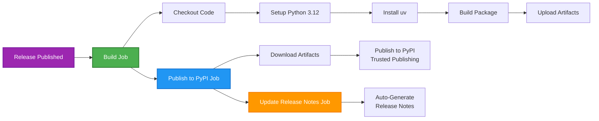

# GitHub Actions Workflows

## Overview

Automated CI/CD pipeline for publishing `source-coop-mcp` to PyPI using **Trusted Publishing** (no API tokens required).

## Workflow: `publish.yml`

**Trigger**: When a GitHub release is published

**Jobs**: Build → Publish → Update Release Notes



## Jobs Details

### 1. Build (`build`)
- **Runtime**: ~30-60 seconds
- **Outputs**: `.whl` and `.tar.gz` packages
- **Steps**:
  1. Checkout repository
  2. Setup Python 3.12
  3. Install `uv` package manager
  4. Build distribution packages
  5. Upload artifacts for next job

### 2. Publish to PyPI (`publish-to-pypi`)
- **Runtime**: ~20-30 seconds
- **Environment**: `pypi` (protected)
- **Security**: OIDC Trusted Publishing (no tokens)
- **Steps**:
  1. Download build artifacts
  2. Publish to PyPI using `pypa/gh-action-pypi-publish@release/v1`
  3. Create package attestations

### 3. Update Release Notes (`github-release`)
- **Runtime**: ~5-10 seconds
- **Feature**: GitHub's auto-generated release notes
- **Steps**:
  1. Generate release notes from PRs/commits
  2. Append to manual release description

## Security

**Trusted Publishing** (OIDC):
- ✅ No API tokens or passwords
- ✅ Cryptographic proof of authenticity
- ✅ Automatic package attestations
- ✅ Environment-based access control

## Configuration Required

### One-Time Setup

1. **PyPI Trusted Publisher**:
   - Visit: https://pypi.org/manage/account/publishing/
   - Add pending publisher:
     - Project: `source-coop-mcp`
     - Owner: `yharby`
     - Repository: `source-coop-mcp`
     - Workflow: `publish.yml`
     - Environment: `pypi`

2. **GitHub Environment**:
   - Create environment named `pypi`
   - Optional: Add protection rules

## Usage

### Create a Release

```bash
# Tag version
git tag -a v0.1.0 -m "Release v0.1.0"
git push origin v0.1.0

# Create release (triggers workflow)
gh release create v0.1.0 \
  --title "v0.1.0" \
  --notes "Initial release"
```

### Monitor Workflow

1. Go to: https://github.com/yharby/source-coop-mcp/actions
2. Watch "Publish to PyPI" workflow
3. Verify all jobs complete successfully

### Verify Publication

```bash
# Check PyPI (wait 2-3 minutes)
pip install source-coop-mcp==0.1.0

# Or with uvx
uvx source-coop-mcp
```

## Best Practices Implemented

✅ **No hardcoded scripts** - Uses GitHub's native features
✅ **Trusted Publishing** - Modern OIDC authentication
✅ **Job separation** - Build, publish, release are independent
✅ **Auto-generated notes** - GitHub handles changelog
✅ **Environment protection** - `pypi` environment controls deployment
✅ **Package attestations** - Cryptographic provenance

## Troubleshooting

### Workflow Fails

**Build Job**:
- Check `pyproject.toml` syntax
- Verify `uv build` works locally

**Publish Job**:
- Verify PyPI Trusted Publisher is configured
- Check `pypi` environment exists
- Ensure version doesn't already exist on PyPI

**Release Notes Job**:
- Usually succeeds (GitHub auto-generation)
- Check workflow logs if fails

### Manual Rollback

```bash
# Delete release and tag
gh release delete v0.1.0
git tag -d v0.1.0
git push origin --delete v0.1.0
```

## Files

- **`publish.yml`** - Main workflow (this directory)
- **`CHANGELOG.md`** - Manual changelog (repo root)
- **GitHub Release Notes** - Auto-generated (per release)

## References

- [PyPI Trusted Publishing](https://docs.pypi.org/trusted-publishers/)
- [GitHub Actions Publishing](https://packaging.python.org/en/latest/guides/publishing-package-distribution-releases-using-github-actions-ci-cd-workflows/)
- [Auto-Generated Release Notes](https://docs.github.com/en/repositories/releasing-projects-on-github/automatically-generated-release-notes)

---

**Last Updated**: 2025-10-19
**Workflow Version**: v1.0
**Maintained by**: @yharby
