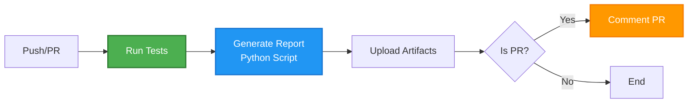

# GitHub Actions Workflows

## Overview

Automated CI/CD pipeline with two workflows:
1. **Test and Report** - Continuous testing with automatic report generation
2. **Publish to PyPI** - Automated publishing using **Trusted Publishing** (no API tokens required)

---

## Workflow 1: `test-and-report.yml`

**Purpose**: Automated testing with comprehensive report generation

**Triggers**:
- Push to `main` or `develop` branches
- Pull requests to `main`
- Manual workflow dispatch

**Key Features**:
- ✅ Runs full test suite with `uv`
- ✅ Generates Markdown reports (via Python script)
- ✅ Comments test results on PRs
- ✅ Stores test reports as artifacts (30 days)

**Quick Links**:
- [View Workflow File](./test-and-report.yml)
- [Test Report Example](#test-report-example)

### Jobs: Test → Report → Comment



### Test Report Example

The workflow generates a comprehensive Markdown report:

```markdown
# 🧪 Test Results Report

**Status**: ✅ ALL TESTS PASSED
**Timestamp**: 2025-10-22 14:30:00 UTC
**Commit**: abc123...
**Branch**: main

## 📊 Test Output
\`\`\`
TEST 1: list_accounts()
✓ Found 94 accounts
✓ Duration: 858ms
...
\`\`\`

## 📈 Performance Metrics
| Tool | Status | Duration |
|------|--------|----------|
| list_accounts | ✓ PASS | 858ms |
\`\`\`
```

Reports are available:
- **As PR Comments**: Automatic feedback on pull requests
- **As Artifacts**: Download from Actions tab (30-day retention)

---

## Workflow 2: `publish.yml`

**Trigger**: When a GitHub release is published

**Jobs**: Build → Publish → Update Release Notes


## Jobs Details

### 1. Build (`build`)
- **Runtime**: ~30-60 seconds
- **Outputs**: `.whl` and `.tar.gz` packages
- **Steps**:
  1. Checkout repository
  2. Setup Python 3.12
  3. Install `uv` package manager
  4. Build distribution packages
  5. Upload artifacts for next job

### 2. Publish to PyPI (`publish-to-pypi`)
- **Runtime**: ~20-30 seconds
- **Environment**: `pypi` (protected)
- **Security**: OIDC Trusted Publishing (no tokens)
- **Steps**:
  1. Download build artifacts
  2. Publish to PyPI using `pypa/gh-action-pypi-publish@release/v1`
  3. Create package attestations

### 3. Update Release Notes (`github-release`)
- **Runtime**: ~5-10 seconds
- **Feature**: GitHub's auto-generated release notes
- **Steps**:
  1. Generate release notes from PRs/commits
  2. Append to manual release description

## Security

**Trusted Publishing** (OIDC):
- ✅ No API tokens or passwords
- ✅ Cryptographic proof of authenticity
- ✅ Automatic package attestations
- ✅ Environment-based access control

## Configuration Required

### One-Time Setup

1. **PyPI Trusted Publisher**:
   - Visit: https://pypi.org/manage/account/publishing/
   - Add pending publisher:
     - Project: `source-coop-mcp`
     - Owner: `yharby`
     - Repository: `source-coop-mcp`
     - Workflow: `publish.yml`
     - Environment: `pypi`

2. **GitHub Environment**:
   - Create environment named `pypi`
   - Optional: Add protection rules

## Usage

### Create a Release

```bash
# Tag version
git tag -a v0.1.0 -m "Release v0.1.0"
git push origin v0.1.0

# Create release (triggers workflow)
gh release create v0.1.0 \
  --title "v0.1.0" \
  --notes "Initial release"
```

### Monitor Workflow

1. Go to: https://github.com/yharby/source-coop-mcp/actions
2. Watch "Publish to PyPI" workflow
3. Verify all jobs complete successfully

### Verify Publication

```bash
# Check PyPI (wait 2-3 minutes)
pip install source-coop-mcp==0.1.0

# Or with uvx
uvx source-coop-mcp
```

## Best Practices Implemented

✅ **No hardcoded scripts** - Uses GitHub's native features
✅ **Trusted Publishing** - Modern OIDC authentication
✅ **Job separation** - Build, publish, release are independent
✅ **Auto-generated notes** - GitHub handles changelog
✅ **Environment protection** - `pypi` environment controls deployment
✅ **Package attestations** - Cryptographic provenance

## Troubleshooting

### Workflow Fails

**Build Job**:
- Check `pyproject.toml` syntax
- Verify `uv build` works locally

**Publish Job**:
- Verify PyPI Trusted Publisher is configured
- Check `pypi` environment exists
- Ensure version doesn't already exist on PyPI

**Release Notes Job**:
- Usually succeeds (GitHub auto-generation)
- Check workflow logs if fails

### Manual Rollback

```bash
# Delete release and tag
gh release delete v0.1.0
git tag -d v0.1.0
git push origin --delete v0.1.0
```

## Files & Directories

- **`test-and-report.yml`** - Test automation workflow (simplified, clean)
- **`publish.yml`** - PyPI publishing workflow
- **`.github/scripts/generate_report.py`** - Report generation script
- **`CHANGELOG.md`** - Manual changelog (repo root)
- **GitHub Release Notes** - Auto-generated (per release)

## References

- [PyPI Trusted Publishing](https://docs.pypi.org/trusted-publishers/)
- [GitHub Actions Publishing](https://packaging.python.org/en/latest/guides/publishing-package-distribution-releases-using-github-actions-ci-cd-workflows/)
- [Auto-Generated Release Notes](https://docs.github.com/en/repositories/releasing-projects-on-github/automatically-generated-release-notes)

## CI/CD Pipeline Summary

```
┌─────────────────────┐
│   Developer Push    │
└──────────┬──────────┘
           │
           ▼
┌─────────────────────────────────────┐
│  Test Workflow (test-and-report)   │
│  • Run all tests                    │
│  • Generate reports (Python)        │
│  • Comment on PR                    │
│  • Store artifacts                  │
└──────────┬──────────────────────────┘
           │
           │ (All tests pass)
           ▼
┌─────────────────────┐
│  Create Release     │
└──────────┬──────────┘
           │
           ▼
┌─────────────────────────────────────┐
│  Publish Workflow (publish)         │
│  • Build package                    │
│  • Publish to PyPI                  │
│  • Generate release notes           │
└─────────────────────────────────────┘
```

## Best Practices

Both workflows follow modern best practices:

✅ **uv Package Manager** - Faster than pip, built-in caching
✅ **GitHub Actions v4** - Latest action versions
✅ **OIDC/Trusted Publishing** - No secrets or tokens
✅ **Artifact Management** - Reports stored for 30 days
✅ **Automated Documentation** - Auto-generated reports and notes
✅ **PR Integration** - Automatic comments with results
✅ **Conditional Execution** - Only runs necessary steps
✅ **Proper Permissions** - Minimal required permissions
✅ **Clean Separation** - Logic in scripts, not in workflows

---

**Last Updated**: 2025-10-22
**Workflow Version**: v2.0 (added test automation)
**Maintained by**: @yharby
