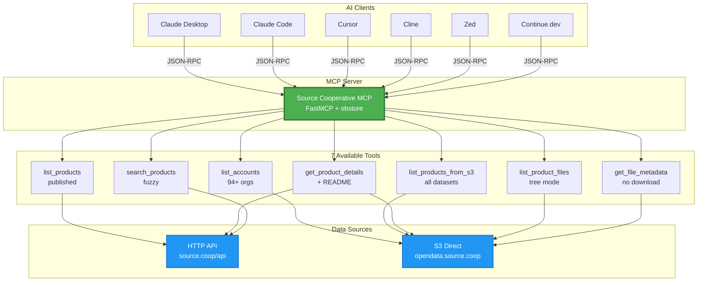

# Source Cooperative MCP Server

[](https://github.com/yharby/source-coop-mcp/actions)
[](https://pypi.org/project/source-coop-mcp/)
[](https://www.python.org/downloads/)
[](https://opensource.org/licenses/MIT)

**Discover and access 800TB+ of geospatial data through AI agents.**

An MCP (Model Context Protocol) server for [Source Cooperative](https://source.coop) - a collaborative repository with datasets from Maxar, Harvard, ESA, USGS, and 90+ organizations.

---

## 🏗️ Architecture Overview



**Key Features:**
- ✅ **Token Optimized** - 72% reduction for large datasets
- ✅ **Smart Partitions** - Auto-detects Hive-style patterns
- ✅ **Fuzzy Search** - Handles typos and partial matches
- ✅ **No Auth** - All 800TB+ is public

---

## 🚀 Quick Start

### Install

```bash
uvx source-coop-mcp
```

### Configure Your AI Client

#### **Claude Desktop / Claude Code / Cursor / Cline**

Add to config file:
- **Claude Desktop**: `~/Library/Application Support/Claude/claude_desktop_config.json` (macOS)
- **Claude Code**: VS Code `settings.json`
- **Cursor**: Cursor settings
- **Cline**: Cline MCP settings

```json
{
  "mcpServers": {
    "source-coop": {
      "command": "uvx",
      "args": ["source-coop-mcp"]
    }
  }
}
```

#### **Zed**

Add to Zed settings:

```json
{
  "context_servers": {
    "source-coop": {
      "command": "uvx",
      "args": ["source-coop-mcp"]
    }
  }
}
```

#### **Continue.dev**

Add to Continue config (`~/.continue/config.json`):

```json
{
  "experimental": {
    "modelContextProtocolServers": [
      {
        "transport": {
          "type": "stdio",
          "command": "uvx",
          "args": ["source-coop-mcp"]
        }
      }
    ]
  }
}
```

**Restart your AI client and start exploring!**

---

## 🛠️ Available Tools

| Tool | Purpose | Performance |
|------|---------|-------------|
| `list_accounts()` | Find all 94+ organizations | ~850ms |
| `list_products()` | List published datasets (HTTP API) | ~240ms |
| `list_products_from_s3()` | List ALL datasets (incl. unpublished) | ~240ms |
| `get_product_details()` | Get metadata + README automatically | ~650ms |
| `list_product_files()` | List files with S3/HTTP paths | ~240ms |
| `list_product_files(show_tree=True)` | Tree view (72% token savings) | ~980ms |
| `get_file_metadata()` | Get file info without downloading | ~230ms |
| `search_products()` | Smart search with fuzzy matching | ~620ms |

---

## 💡 What You Can Do

### Discover Data

```
"List all organizations in Source Cooperative"
→ Returns 94+ organizations: maxar, planet, harvard, etc.

"Find all datasets for harvard-lil"
→ Discovers published + unpublished products

"Search for climate datasets"
→ Smart fuzzy search handles typos and partial matches
```

### Access Files

```
"List files in harvard-lil/gov-data"
→ Returns S3 paths and HTTP URLs ready for analysis

"Show me the file tree with partition detection"
→ Smart visualization: year={2020,2021,...+5 more}/ [partitioned]

"Get file metadata without downloading"
→ Size, last modified, ETag
```

### Smart Search

```
"Search for climte" (typo)
→ Finds "climate" datasets (fuzzy matching)

"Search for geo" (partial)
→ Finds "geospatial", "geocoding", etc.
```

---

## ⚡ Features

| Feature | Description |
|---------|-------------|
| **Complete Discovery** | Finds unpublished products the official API doesn't show |
| **No Authentication** | All 800TB+ data is public |
| **Fast Performance** | Rust-backed S3 client (9x faster than boto3) |
| **Token Optimized** | Tree mode: 72% token reduction for large datasets |
| **Smart Partitions** | Auto-detects patterns: `year={2020,2021,...}` |
| **Fuzzy Search** | Handles typos and partial matches |
| **README Integration** | Documentation automatically included |
| **800TB+ Data** | 94+ organizations, geospatial datasets |

---

## 📋 Example Workflow

```
1. "List all organizations"
   → Get 94+ account names

2. "Show me all datasets from maxar"
   → Discover published + unpublished products

3. "Search for climate data"
   → Smart fuzzy search finds relevant datasets

4. "Get details for harvard-lil/gov-data"
   → Full metadata + README content

5. "List files in this dataset with tree view"
   → Token-optimized tree with partition detection
```

---

## 🎯 Why This Server?

### Problem
Source Cooperative has 800TB+ of valuable data, but:
- Official API only shows **published** products
- No auto-discovery of organizations
- Requires knowing what you're looking for

### Solution
This MCP server provides:
- ✅ Complete auto-discovery (published + unpublished)
- ✅ Smart search with fuzzy matching
- ✅ Direct S3 access for all files
- ✅ Token-optimized outputs (72% reduction)
- ✅ Smart partition detection (10-88% additional savings)
- ✅ README documentation included automatically
- ✅ No authentication required

---

## 📊 Performance

All operations complete in **under 1 second**:

```
list_accounts():              ~850ms  (94+ organizations)
list_products_from_s3():      ~240ms  (S3 direct)
list_product_files():         ~240ms  (simple list)
list_product_files(tree=True): ~980ms  (72% token savings)
get_file_metadata():          ~230ms  (HEAD only)
search_products():            ~620ms  (fuzzy matching)
```

### Token Optimization Impact

| Dataset Size | Without Tree | With Tree | Saved |
|--------------|--------------|-----------|-------|
| 10 files | 1,500 tokens | 415 tokens | 72.3% |
| 100 files | 15,000 tokens | 4,150 tokens | 72.3% |
| 1,000 files | 150,000 tokens | 41,500 tokens | 72.3% |

With partition detection (1,000 partitions): **88% total savings!**

---

## 🔧 Requirements

- **Python**: 3.11 or higher
- **Package Manager**: `uv` (installed automatically by `uvx`)
- **Operating Systems**: macOS, Linux, Windows

---

## 🤝 Development

See [DEVELOPMENT.md](DEVELOPMENT.md) for:
- Architecture details
- Testing instructions
- Contributing guidelines
- Performance benchmarks
- Token optimization details

---

## 📝 Support

- **Issues**: [GitHub Issues](https://github.com/yharby/source-coop-mcp/issues)

---

## 📄 License

MIT License - see [LICENSE](LICENSE) for details.
