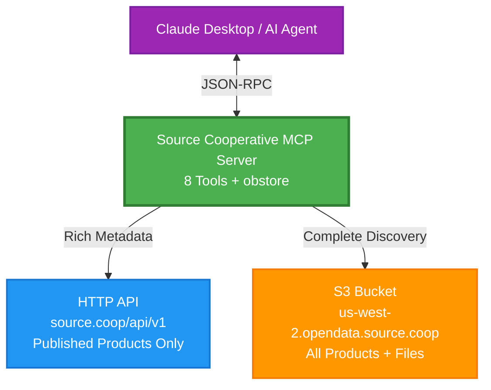

# Source Cooperative MCP Server

[](https://www.python.org/downloads/)
[](https://opensource.org/licenses/MIT)
[](https://github.com/astral-sh/ruff)

**Discover and access 800TB+ of geospatial data through Claude and other AI agents.**

An MCP (Model Context Protocol) server providing complete auto-discovery and data exploration for [Source Cooperative](https://source.coop) - a collaborative open data repository hosting datasets from organizations like Maxar, Harvard Library, ESA, and USGS.

## Architecture



## Why This Matters

Source Cooperative contains 800TB+ of valuable geospatial datasets, but discovering what's available requires knowing what to look for. This MCP server solves that by:

- **Auto-discovering** all 92+ organizations and their datasets
- **Finding hidden products** not visible in the official API
- **Providing analysis-ready S3 paths** for immediate data access
- **No authentication required** - all data is public

## Quick Install

### Option 1: uvx (Recommended)

Install directly for use with Claude Desktop:

```bash
# From PyPI (once published)
uvx source-coop-mcp

# Or from GitHub
uvx install git+https://github.com/yharby/source-coop-mcp.git
```

Add to Claude Desktop (`~/Library/Application Support/Claude/claude_desktop_config.json`):

```json
{
  "mcpServers": {
    "source-coop": {
      "command": "uvx",
      "args": ["source-coop-mcp"],
      "env": {
        "SOURCE_COOP_INCLUDE_README": "true"
      }
    }
  }
}
```

**Environment Variables**:
- `SOURCE_COOP_INCLUDE_README`: Set to `"true"` to automatically include README content in all `get_product_details()` responses (default: `"false"`)
  - When enabled, every product details call will include a `readme` field with markdown content from the product root
  - When disabled (default), README is not included unless explicitly requested via `include_readme=True` parameter

Restart Claude Desktop and you're ready!

### Option 2: Development Install

For contributing or local development:

```bash
git clone https://github.com/yharby/source-coop-mcp.git
cd source-coop-mcp
uv sync
```

Add to Claude Desktop config:

```json
{
  "mcpServers": {
    "source-coop": {
      "command": "uv",
      "args": [
        "--directory",
        "/absolute/path/to/source-coop-mcp",
        "run",
        "src/source_coop_mcp/server.py"
      ],
      "env": {
        "SOURCE_COOP_INCLUDE_README": "true"
      }
    }
  }
}
```

## What You Can Do

### Discover Data

```
List all organizations in Source Cooperative
→ Returns 92+ accounts including maxar, planet, harvard-lil, etc.

Find all datasets under the "vida" organization
→ Returns published products with titles and descriptions

Show me ALL products for youssef-harby (including unpublished)
→ Returns 5 products (API only shows 3!)
```

### Access Files

```
List all files in harvard-lil/gov-data
→ Returns file listings with S3 URIs and HTTP URLs

Get metadata for youssef-harby/exiobase-3/goose-agent.yaml
→ Returns size, last modified, ETag without downloading

Show me the README for harvard-lil/gov-data
→ Returns markdown documentation
```

### Search & Filter

```
Find all datasets about "climate" in the harvard-lil account
→ Fast search within specific account, returns ranked results

Show me all featured/curated datasets
→ Returns only datasets marked as featured by Source Cooperative
```

**Performance Tip**: Always provide `account_id` for fast searches (~500ms). Searching all accounts takes 30-60s.

## Features

### Complete Discovery

Unlike the Source Cooperative web UI, this server discovers:
- ✅ Published products (visible in API)
- ✅ Unpublished products (only in S3)
- ✅ All 92+ organizations
- ✅ Complete file inventories

### Hybrid Architecture

Uses the best of both worlds:
- **HTTP API** for rich metadata (titles, descriptions, dates)
- **S3 Direct** for complete discovery and file access
- **Rust-backed obstore** for faster S3 operations

### Key Capabilities

| Capability | Details |
|------------|---------|
| Organizations | 92+ accounts (Maxar, Planet, Harvard, ESA, USGS, etc.) |
| Datasets | 800TB+ of geospatial data |
| Performance | 9x faster than traditional S3 clients |
| Authentication | None required - all data is public |
| Unpublished Data | Discovers products not visible in API |

## 8 Available Tools

### Discovery

| Tool | Purpose | Example |
|------|---------|---------|
| `list_accounts()` | Find all 92+ organizations | ~100ms |
| `list_products(account_id?, featured_only?)` | List published datasets | 200-500ms |
| `list_products_from_s3(account_id, include_file_count?)` | List ALL datasets (including unpublished) | 1-3s |

### Product Info

| Tool | Purpose |
|------|---------|
| `get_product_details(account_id, product_id, include_readme?)` | Get full metadata with optional README content from product root |

**README Integration**:
- Set `include_readme=True` to include README markdown content in the response
- Or set `SOURCE_COOP_INCLUDE_README=true` env var to always include README
- README is fetched from product root directory (case-insensitive: README.md, readme.md, etc.)
- Returns `readme` field with: `{found, content, size, path, filename, last_modified, url}`

### File Operations

| Tool | Purpose |
|------|---------|
| `list_product_files(account_id, product_id, prefix?, max_files?)` | List files with S3/HTTP paths |
| `get_file_metadata(path)` | Get file info without downloading |

### Search

| Tool | Purpose |
|------|---------|
| `search_products(query, account_id?, search_in?)` | Search datasets by keywords |
| `get_featured_products()` | Get curated/highlighted datasets |

## Important: Published vs Unpublished

Source Cooperative has a key distinction:

**Published Products** (API visible):
- Have titles, descriptions, metadata
- Appear in web UI and API
- Example: `harvard-lil/gov-data`

**Unpublished Products** (S3 only):
- Uploaded to S3 but not registered in database
- Files accessible but no API metadata
- **Not discoverable via HTTP API**
- Example: `youssef-harby/exiobase-3`

This is why we provide TWO discovery tools:

```python
# HTTP API - Only published (3 products)
list_products("youssef-harby")

# S3 Direct - Everything (5 products)
list_products_from_s3("youssef-harby")
```

**Always use `list_products_from_s3()` for complete discovery.**

## Example Usage

### Get Product Details with README

```
Get details for fused/overture with README content
```

The MCP server will:
1. Fetch product metadata from API (title, description, account info)
2. Search for README.md in product root
3. Include full markdown content in response

**Response includes**:
```json
{
  "title": "Overture Maps - Fused-partitioned",
  "description": "...",
  "readme": {
    "found": true,
    "content": "# Overture - Fused-partitioned\n\n## Overview...",
    "size": 3448,
    "path": "fused/overture/README.md",
    "url": "https://data.source.coop/fused/overture/README.md"
  }
}
```

### Find All Data for an Organization

```
Show me all products under "maxar" including file counts
```

The MCP server will:
1. Scan S3 directly for all products
2. Count files in each product
3. Return complete inventory

### Access Unpublished Product

```
List files in youssef-harby/exiobase-3
```

Even though this product returns 404 from the API, the MCP server can still:
1. Access files via S3 direct
2. Return full file listings with URLs
3. Get file metadata

### Search for Datasets

```
Find all datasets about "climate" in the harvard-lil account
```

The MCP server will:
1. Query published products from the account
2. Search titles, descriptions, and product IDs
3. Return ranked results by relevance score

**Performance Note**: Always specify `account_id` for fast searches (~500ms). Searching all accounts takes 30-60s.

## Technology Stack

- **FastMCP 2.12.5+** - MCP server framework with lifecycle management
- **obstore 0.8.2+** - Rust-backed S3 client (faster than boto3)
- **httpx 0.28.1+** - Async HTTP client for API calls
- **Python 3.12+** - Modern Python with full async support

## Performance

| Operation | Latency | Notes |
|-----------|---------|-------|
| List accounts | ~100ms | Full S3 bucket scan |
| List products (HTTP API) | 200-500ms | Single account |
| List products (S3 direct) | 1-3s | With file counts |
| Search products | 200-500ms | With account_id specified |
| Search products (all) | 30-60s | Without account_id (all 92 accounts) |
| List files (1000 files) | 500ms-2s | obstore performance |
| File metadata | ~150ms | S3 head operation |
| README fetch | +200-300ms | Added to product details when enabled |

**Why so fast?**

obstore uses Rust internally with Apache Arrow format:
- 9x throughput vs boto3 for concurrent operations
- 40% memory reduction
- Zero-copy data structures

## Development

### Run Tests

```bash
# Test S3 discovery
uv run python tests/test_s3_discovery.py

# Compare API vs S3 results
uv run python tests/test_api_vs_obstore.py

# Test README integration
uv run python tests/test_simplified_readme_integration.py

# Test search functionality
uv run python tests/test_search.py

# Test obstore basics
uv run python tests/test_obstore.py
```

### Code Quality

```bash
# Format code
uv run ruff format .

# Lint
uv run ruff check .

# Auto-fix issues
uv run ruff check --fix .
```

### Test with MCP Inspector

```bash
npx @modelcontextprotocol/inspector uv run src/source_coop_mcp/server.py
```

Opens a web interface to test all tools interactively.

## Documentation

- **[ARCHITECTURE.md](docs/ARCHITECTURE.md)** - System architecture, data flow diagrams, use cases
- **[SOURCE_COOP_API.md](docs/SOURCE_COOP_API.md)** - Complete API reference with curl examples and schemas
- **[PUBLISHING.md](docs/PUBLISHING.md)** - Guide for publishing to PyPI using Trusted Publishing
- **[RELEASE_CHECKLIST.md](docs/RELEASE_CHECKLIST.md)** - Quick release checklist
- **[.github/workflows/README.md](.github/workflows/README.md)** - CI/CD workflow documentation with diagrams

## Troubleshooting

### Server Not Appearing in Claude Desktop

1. Check config syntax is valid JSON
2. Restart Claude Desktop completely
3. Check logs in Claude Desktop developer tools

### Products Not Found

Some products may be unpublished. Try:

```
Use list_products_from_s3 instead of list_products
```

This scans S3 directly and finds ALL products.

### Slow Performance

For faster results:

```
# Instead of listing all accounts
list_products()  # 30-60s for all 92 accounts

# Filter by account
list_products(account_id="maxar")  # 200-500ms
```

## Requirements

- **Python**: 3.12 or higher
- **uv**: Modern Python package manager (auto-installed by uvx)
- **Claude Desktop**: For MCP integration (optional)

## License

MIT

## Contributing

Contributions welcome! Please:

1. Read [docs/ARCHITECTURE.md](docs/ARCHITECTURE.md) first
2. Run tests and linting before submitting
3. Keep documentation updated

## Support

- **Issues**: [GitHub Issues](https://github.com/yharby/source-coop-mcp/issues)
- **Docs**: See `docs/` directory
- **Source Cooperative**: [source.coop](https://source.coop)

## Credits

Built with:
- [FastMCP](https://gofastmcp.com/) - MCP server framework
- [obstore](https://developmentseed.org/obstore/) - Object storage client
- [Source Cooperative](https://source.coop) - Open geospatial data repository

---

**Discover. Access. Analyze.** Start exploring 800TB+ of open geospatial data through AI.
